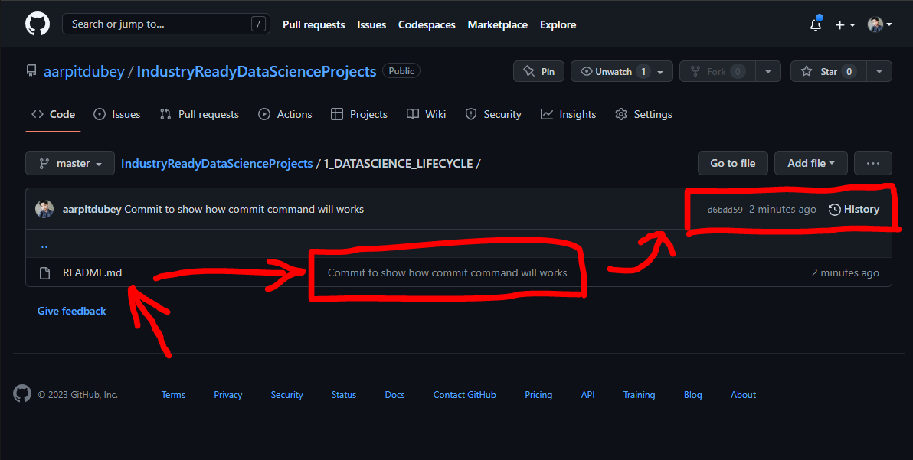

# Introduction To Git and Github :

## VC (Version Control) :

- VC is a system that records changes to a file or set of files over time, so that you can recall specific versions later.

- VCS (Version Control system) also generally means that if you screw things up or lose files, you can easily recover them.

## What is Git?

- Git is a distributed version control system that allows developers and operations teams to collaborate and keep track of<br> the changes made on a project.

- It is a software for tracking changes in any set of files, usually used for coordinating work among programmers collaboratively <br>developing source code during softwaredevelopment.

- its primary goals includes speed, data security (SHA-256) and integrity.

## Why Git?

1. It saves time

2. You can work offline then you can pull changes and push your changes.

3. you can undo or revert changes

4. you can be safe from mixing up things and creating multiple folders with names like<br> "final", "final_part1", "final_part2", "final_part3", and so on.

5. Making useful commits with messages make you remind why you make these changes or for what? 

## What is Github?

- It is a Internet hosting service for software development and version control using Git.

- It is Online software development, hosting and version control platform.

How to create repositories in Github, let's see:


Now, the same task we can do from CMD using Git commands.

Before jumping to CMD, you have to download the git software or distributed VCS in your computer system : [Click to download Git](https://git-scm.com/).

Step 1 :  Goto to your Project Directory and create a new folder and name it anything you want.

Step 2 : I prefer VSCode Editor but you can choose any one of your choice. Open it with that folder, if the Text editor have terminal then <br>it's good but if not then open CMD and change directory(using cd command) to your project directory and folder.

Step 3 : In VSCode edtior, terminal is there but you can do the same from Command Prompt too. From the current working directory in<br> CMD change to your project folder and type this command : ```git init``` 

1. ### ```git init :``` This command is use to create a new repository locally from CMD.
let's see how : 


2. ### ```git status :``` This command is used to check the status of your repository means it displays the state of the working directory and the staging area.


## Configure your Git username/email

- You typically configure your global username and email address after installing Git. However, you can do so now if you missed<br> that step or want to make changes. After you **set your global configuration**, repository-specific configuration is optional.


### To set your global username/email configuration:

1. Open the command line.

2. Set your username:
```git config --global user.name "FIRST_NAME LAST_NAME"```

3. Set your email address:
```git config --global user.email "MY_NAME@example.com"```

### To set repository-specific username/email configuration:

1. From the command line, change into the repository directory.

2. Set your username:
```git config user.name "FIRST_NAME LAST_NAME"```

3. Set your email address:
```git config user.email "MY_NAME@example.com"```

4. Verify your configuration by displaying your configuration file:
```cat .git/config```

let us see how to configure:


3. ### Git command to add a new single or multiple files in project repositary:


* ### ``` git add <FILE_NAME> : ``` It is use to add single specific file in project repositary.

* ### ``` git add . : ``` It is use to add All the files which are added to the project repositary.

let's see how it will work with single/multiple files:


<br>

Now, you learn how to create repositories, checking status and, how to add those files and changes <br> now, it's time to learn how we can commit changes and push it to Github.

<br>For commiting any changes or files in your repositary there is git command:


4. ### ```git commit -m "<Pass some message>" :``` This command is use to commit the changes/modification <br>you had done in your project repositary.

5. ### ```git push : ``` To push those commits to Github we need push command.

let's see how it will works:


<br>



## How to change the branch of your project repositary?

6. ### ```git branch -M <branch_name> :```
    - We can change the branch of project repository using ```git branch -M <branch to branch_name>``` or to change from Master branch to main branch ```git branch -M main```.

    here we can see how it will work:

    

## How to create a new branch ? (creating a developer branch)

7. ### ```git branch <branch_name> :``` 
    - We can create the new branch (or) developer of project repository using ```git branch <branch_name> (OR) git branch developer```.

    here we can see how it will work


    

<br>

8. ### ```git checkout <branch_name> :```
- Allows you to switch between branches or restore working directory files. To change branch from main to developer 
have to use ```git checkout developer```.<br><br>
here we can see how it will work

    


9. ### ```git pull :``` Fetches and merges changes from a remote repository to the local repository.

10. ### ```git branch :``` Lists all branches in a repository, and highlights the current branch.

## There are more git command which useful in daily life<br>a skillfull developer you can try those are given below:<br><br>

11. ### ```git merge :``` Merges changes from one branch into another.
<br>

12. ### ```git log :``` Shows a log of commits on the current branch.

<br>

13. ### ```git diff :``` Shows the differences between the working directory, the staging area, and the most recent commit.

<br>

14. ### ```git show :``` Shows the details of a specific commit, such as the commit message and the changes made.

<br>

15. ### ```git stash :``` Temporarily saves changes that haven't been committed, so you can switch to a different branch.

<br>

16. ### ```git tag :``` Adds a tag to a specific commit, which can be used to mark a release or a significant change.

<br>

17. ### ```git fetch :``` Fetches changes from a remote repository, but doesn't merge them into the local repository.

<br>

18. ### ```git remote  :``` Shows a list of remote repositories that the local repository is connected to.

<br>

19. ### ```git config :``` Allows you to set configuration options for a repository, such as your user name and email.

<br>

20. ### ```git reset :``` Reverts commits and changes in the local repository.

<br>

21. ### ```git clean :``` Removes untracked files and directories from the working directory.

Now you can explore more and read the documentations.
Thank you.