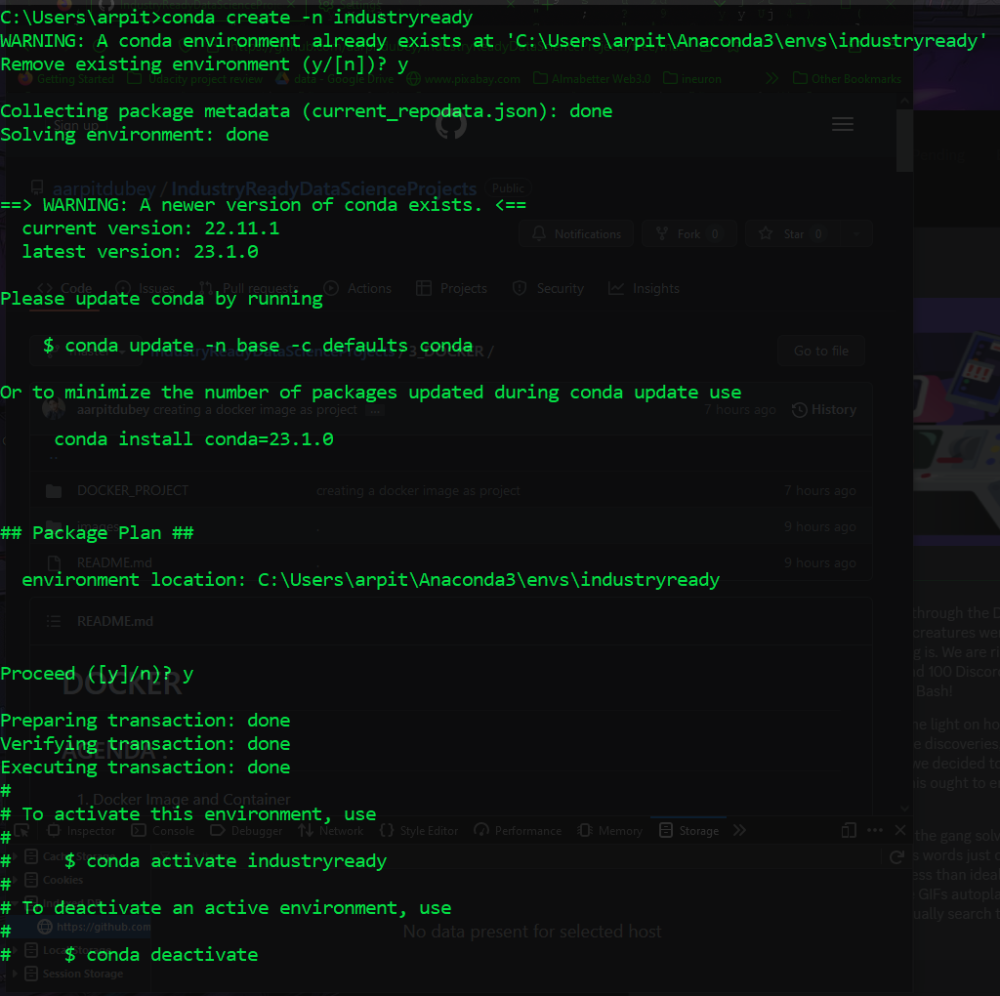
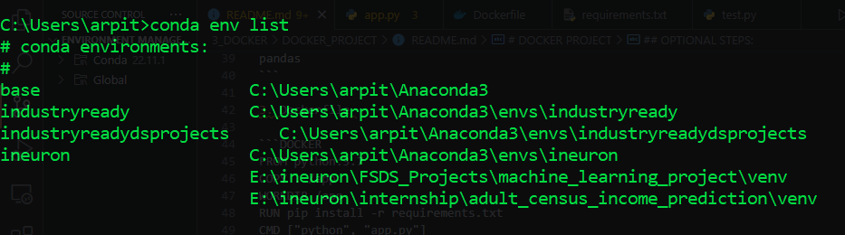
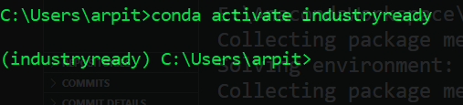
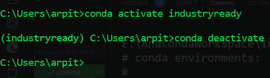
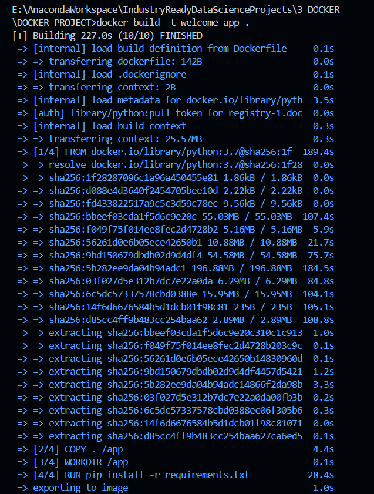
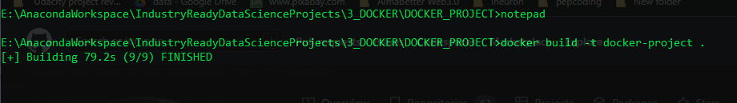
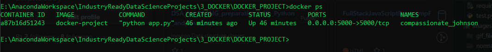
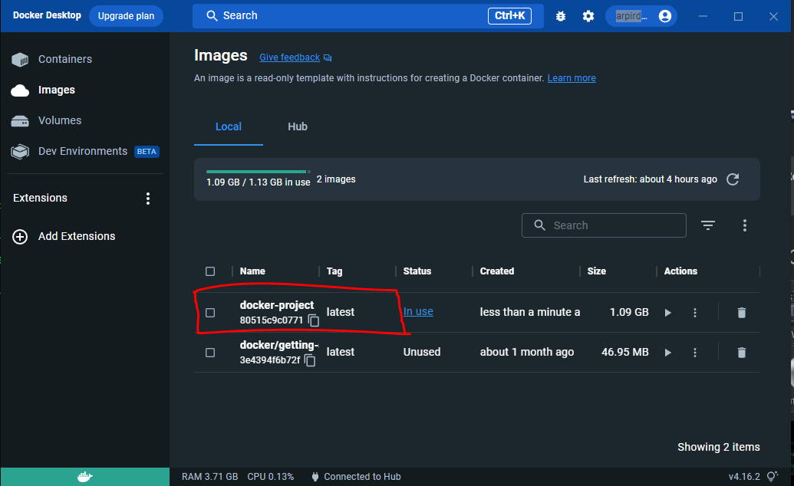
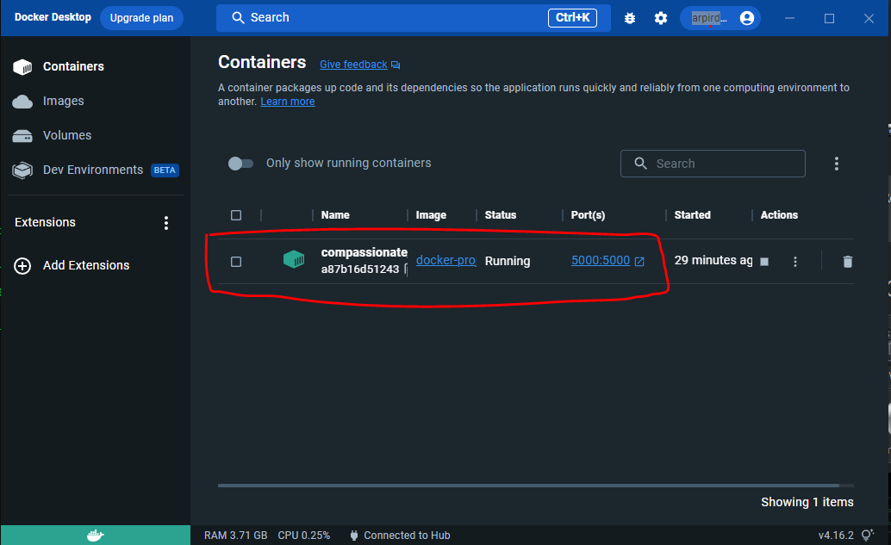
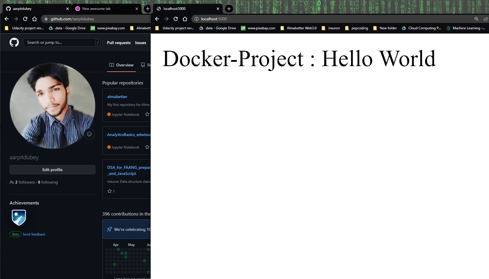

# DOCKER PROJECT

<span style="font-size:20px;">**Problem Statement:**</span><span style="font-size:16px;"> Create an application in flask web framework, converting it as a Docker image file and run it as a Docker container to execute the application.</span>

Steps:

1. Create app.py file as the base file to execute the application.

2. Create requirements.txt file for the required packages and libraries and frameworks.

3. Create a Dockerfile to run requirements.txt file and execute app.py (application) file.


File and code:

1. app.py file

```PYTHON
from flask import Flask
import numpy as np
import pandas as pd

app = Flask(__name__)

@app.route('/', methods=['GET'])

def home():
    return "Hello World"


if __name__ == '__main__':
    app.run(host='0.0.0.0', debug=True)
```
2. requirements.txt file

```TEXT
flask
numpy
pandas
```

3. Dockerfile 

```DOCKER
FROM python:3.7
COPY . /app
WORKDIR /app
RUN pip install -r requirements.txt
CMD ["python", "app.py"]
```

## OPTIONAL STEPS:

1. Create a new conda environment for provide proper environment, <br>to execute the **app.py** in your local machine. **let's create a new environment "industryready"** 

- **conda create -n ENV_NAME**



2. Listing out all the conda environment.

- **conda env list**



3. To activate the conda environment Here, in this case **environment name<br>(or) ENV_NAME** is "industryready"

- **conda activate ENV_NAME**



4. To deactivate that environment, use this command

- **conda deactivate**



<br>

5. Doing all the above steps :


## Let's build our project docker image:

1. To build docker image, use this command

- **docker build -t docker-project .**



this is docker image 



2. Check our custome project docker image

- **docker ps**





3. Run docker container

- **docker run -d -p 5000:5000 docker-project**



4. check whether docker container is running or not using **docker ps** command


5. **Completing the project**


 **This is the output displayed from our custome docker image, docker container:**




<br>Now, we created our own flask application and build our docker image and run docker container **successfully** getting the expected output further we can **push this image to docker hub** too.


## <span align="center">Thank you</span> 