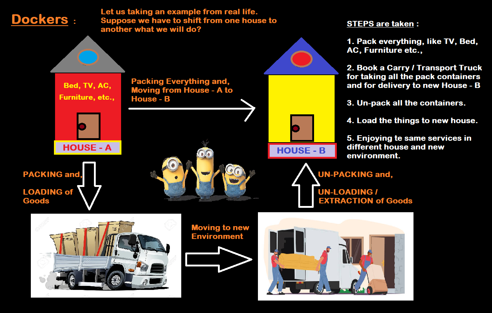

# DOCKER

## AGENDA : 

1. Docker Image and Container

2. Some basics commands with Docker

3. Create a Docker image

4. Run it as a container

## Whay is Docker?

- Docker is a platform that allows developers to easily create, deploy, and run applications in containers.

## What are Docker Container?

- Docker Containers are a lightweight form of virtualization that allow an application and its dependencies to run in an isolated environment, without affecting the host system or other containers running on it.

> NOTE : A Docker container is a running instance of a Docker image. 

## What is Docker Image?

- An image is a lightweight, stand-alone, executable package that includes everything needed to run a piece of software, including the code, a runtime, libraries, environment variables, and config files.

- Docker images are built from a series of layers, which are similar to snapshots. Each layer represents a command in the Dockerfile and its associated file system changes. This allows images to be built incrementally and reused, reducing the size of the final image.

### HOUSE REAL LIFE EXAMPLE for better understanding of the Docker, container, and image.



## Here are some commonly used Docker commands:

1. ### ```docker run :``` Runs a command in a new container.

2. ### ```docker start :``` Starts an existing container.

3. ### ```docker stop :``` Stops a running container.

4. ### ```docker build :``` Builds an image from a Dockerfile.

5. ### ```docker pull :``` Pulls an image from a registry, such as Docker Hub.

6. ### ```docker push :```Pushes an image to a registry.

7. ### ```docker exec :``` Runs a command in an existing container.

8. ### ```docker ps :``` Lists all running containers.

9. ### ```docker logs :``` Shows the logs of a container.

10. ### ```docker rm :``` Removes one or more containers.

11. ### ```docker rmi :``` Removes one or more images.

12. ### ```docker network :``` Manage Docker networks

13. ### ```docker volume :``` Manage Docker volumes

14. ### ```docker inspect :``` Inspect the details of a container or image

15. ### ```docker compose :``` Define and run multi-container Docker applications using a compose file.

16. ### ```docker system prune :``` Removes all stopped containers, all networks not used by at least one container, all images without at least one container associated to them and all build cache.

17. ### ```docker create :``` Creates a new container but does not start it.

18. ### ```docker cp :``` Copies files or folders between a container and the local filesystem.

19. ### ```docker events :``` Get real-time events from the server.

20. ### ```docker export :``` Exports a container’s filesystem as a tar archive.

21. ### ```docker import :``` Imports the contents from a tarball to create a filesystem image.

22. ### ```docker history :``` Shows the history of an image.

23. ### ```docker pause :``` Pauses all processes within a container.

24. ### ```docker port :``` Lists the port mappings or a specific mapping for the container.

25. ### ```docker rename :``` Renames a container.

26. ### ```docker restore :``` Restores a container from a previous image.

27. ### ```docker save :``` Saves one or more images to a tar archive (streamed to STDOUT by default).

28. ### ```docker tag :``` Tags an image in the local repository.

29. ### ```docker wait :``` Blocks until a container stops, then prints its exit code.

30. ### ```docker top :``` Shows the processes running inside a container.

31. ### ```docker stats :``` Shows a live stream of container(s) resource usage statistics

32. ### ```docker load :``` Load an image from a tar archive or STDIN

33. ### ```docker login :``` Log in to a Docker registry

34. ### ```docker logout :``` Log out from a Docker registry

35. ### ```docker system df :``` Show Docker disk usage

36. ### ```docker system info :``` Display system-wide information

37. ### ```docker update :``` Update configuration of one or more containers

38. ### ```docker plugin :``` manage plugins

39. ### ```docker swarm :``` manage swarm

40. ### ```docker service :``` manage services

41. ### ```docker secret :``` manage secrets

42. ### ```docker config :``` manage configurations

43. ### ```docker node :``` manage swarm nodes

44. ### ```docker network create :``` create a network

45. ### ```docker network rm :``` remove one or more networks

46. ### ```docker volume create :``` create a volume

47. ### ```docker volume rm :``` remove one or more volumes

48. ### ```docker stack :``` manage stack

49. ### ```docker stack deploy :``` deploy a new stack or update an existing stack

50. ### ```docker stack rm :``` remove one or more stacks.

There are more docker commands available

some more I have to give for better performance of docker:

- ### ```docker run --rm :``` Automatically remove the container when it exits

- ### ```docker exec -it :``` Run a command in a running container in interactive mode

- ### ```docker inspect --format :``` Format the output of docker inspect command

- ### ```docker build --no-cache :``` Build an image without using the cache

- ### ```docker network connect :``` Connect a container to a network

- ### ```docker network disconnect :``` Disconnect a container from a network

- ### ```docker container prune:``` Removes all stopped containers

- ### ```docker image prune :``` Remove unused images

- ### ```docker volume prune :``` Remove unused volumes

- ### ```docker system prune --volumes :``` Remove all unused containers, networks, images and volumes

- ### ```docker container ls --all :``` List all containers (default shows just running)

- ### ```docker image ls -a :``` List all images (default shows just the most recent)

- ### ```docker volume ls :``` List all volumes

- ### ```docker network ls :``` List all networks