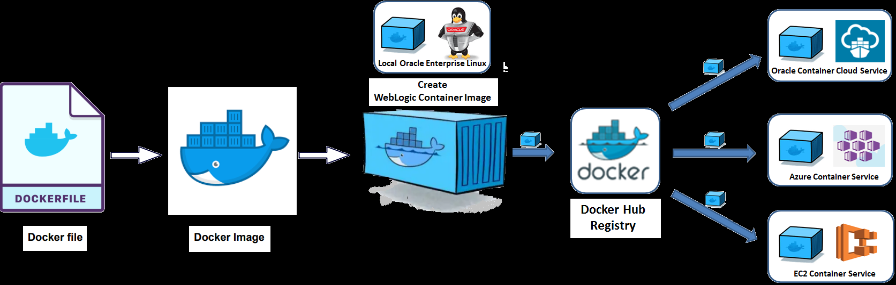
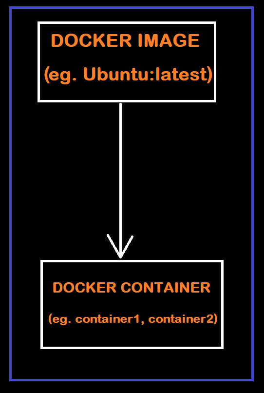
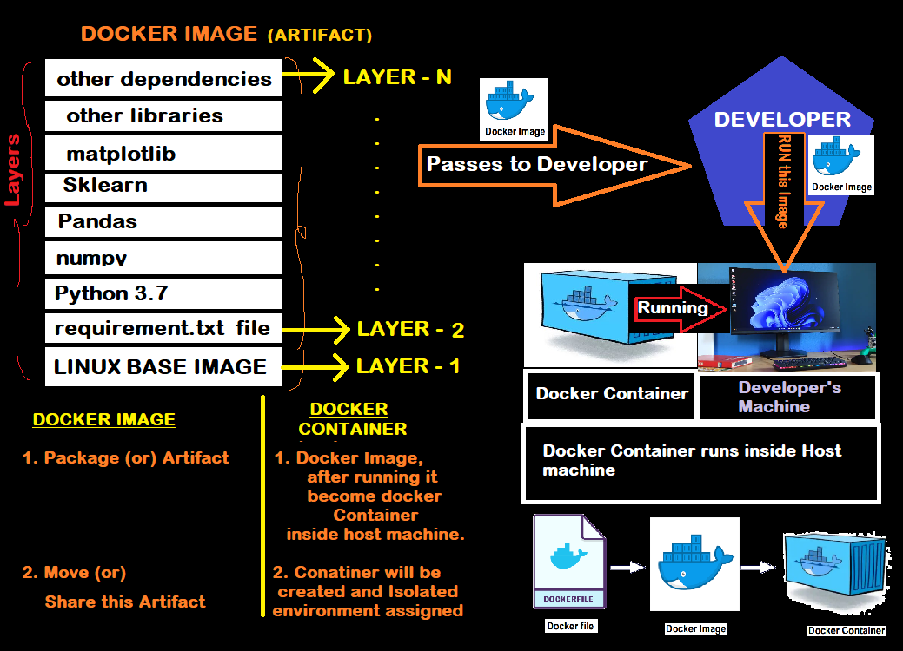
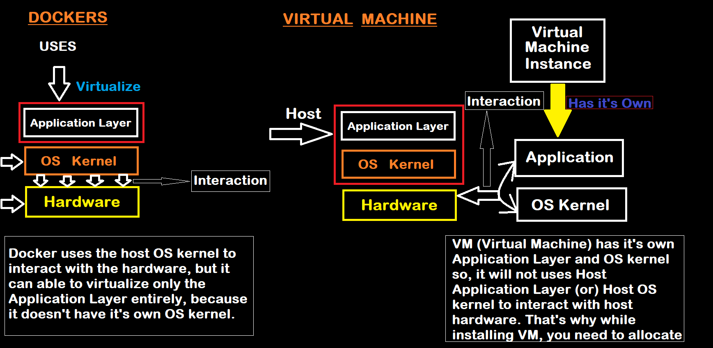

# DOCKER

## AGENDA : 

1. Docker Image and Container

2. Some basics commands with Docker

3. Create a Docker image

4. Run it as a container

## Whay is Docker?

- Docker is a platform that allows developers to easily create, deploy, and run applications in containers.

## What are Docker Container?

- Docker Containers are a lightweight form of virtualization that allow an application and its dependencies to run in an isolated environment, without affecting the host system or other containers running on it.

> NOTE : A Docker container is a running instance of a Docker image. 

## What is Docker Image?

- An image is a lightweight, stand-alone, executable package that includes everything needed to run a piece of software, including the code, a runtime, libraries, environment variables, and config files.

- Docker images are built from a series of layers, which are similar to snapshots. Each layer represents a command in the Dockerfile and its associated file system changes. This allows images to be built incrementally and reused, reducing the size of the final image.

### HOUSE REAL LIFE EXAMPLE for better understanding of the Docker, container, and image.<br><br>


<br>

- It is the efficient way to move all items/containers from House-A to House-B, and If we have to move each item/container for eg. TV set one-by-one then it takes huge amount of efforts, time and a lot of travel round or operations if we carry each item and place them one-by-one to house-B.

- In Similar way, we can imagine Docker as "the Movers and Packers team" (who pack your items into containers and put them into truck and move from one environment to another).

- Lets look into example of two developers from development team.
We have Developer-1 and Developer-2

- Developer-1 try to install multiple packages and software applications in his system and all the packages and software installed successfully.

- Developer-2 she also try to install all those packages and softwares which are installed by Developer-1 but one of the software application give error while installation, both are connected to the Dev Server but Application still running on the server but that application stop running in Developer-2 local system because she fails to provide the same/compatible environment for Application. 

- Quality Assurance (QA) team also fails to run the application because of that missed or failed installation. This leads to conflict between Developers and QA Team. For resolving this conflicts Google introduce docker.




## Difference between Docker images and Docker containers :

- A Docker image is a lightweight, stand-alone, executable package that includes everything needed to run a piece of software, including the code, a runtime, libraries, environment variables, and config files. Docker images are built from a series of layers, which are similar to snapshots. Each layer represents a command in the Dockerfile and its associated file system changes. This allows images to be built incrementally and reused, reducing the size of the final image.

- A Docker container is a running instance of a Docker image. When you run a command like ```docker run <image>```, Docker creates a new container from the image and starts it. The container runs in an isolated environment, separate from the host system and other containers, but it has access to the host's resources, such as the network and the file system.




- Each container can have different runtime and configuration settings, but they are all based on the same image. You can think of an image as a class and a container as an instance of that class.

- You can also create multiple containers from the same image and run them simultaneously, each with its own isolated environment and resources.

- Docker images are stored in a registry, such as Docker Hub, where they can be shared and reused by other users. You can also create your own images and share them on a registry or within your organization.



**Base image :** The base image / base OS, where entire application can be run.
It can be of Linux, ubuntu, windows according to the requirements.

- In next layer, suppose we have to install python 3.7 -> it is called the sub-layer-image (or) sub-image (or) sub-sub-sub-part.

- Similar, way other dependencies are set layer-by-layer or in sub-sub-sub layer.

All the dependencies, set layer-by-layer and combine-ly called as Docker Image.

- When we pass, this docker image to another developer then developer can run this docker image inside Host machine in the form of container, so, we can say Docker Image is an Artifact.

- This container is running on the developer host machine and docker image run inside container.



<br>

<table class="tg">
<thead>
  <tr>
    <th class="tg-0lax">DOCKER</th>
    <th class="tg-0lax">VIRTUAL MACHINE</th>
  </tr>
</thead>
<tbody>
  <tr>
    <td class="tg-0lax">1. Docker uses the host OS kernel to interact with the hardware, but it can able to virtualize only the Application Layer entirely, because it doesn't have it's own OS kernel.</td>
    <td class="tg-0lax">1. VM (Virtual Machine) has it's own Application Layer and OS kernel so, it will not uses Host Application Layer (or) Host OS kernel to interact with host hardware. That's why while installing VM, you need to allocate Ram and Hard disk memory, etc,.</td>
  </tr>
  <tr>
    <td class="tg-0lax">2. Docker image is usually small in size(in MB). Docker is fast!</td>
    <td class="tg-0lax">2. VM (Virtual Machine) is slow because the size of files are in GB, to large files as compare to Docker.</td>
  </tr>
  <tr>
    <td>VM can be install in any machine having any Operating system --> No Compatibility issue will arises.</td>
    <td>Docker is dependent on host OS to interact with hardware, for some application Compatibility issue may arises.</td>
  </tr>
</tbody>
</table>

## Here are some commonly used Docker commands:

1. ### ```docker run :``` Runs a command in a new container.

2. ### ```docker start :``` Starts an existing container.

3. ### ```docker stop :``` Stops a running container.

4. ### ```docker build :``` Builds an image from a Dockerfile.

5. ### ```docker pull :``` Pulls an image from a registry, such as Docker Hub.

6. ### ```docker push :```Pushes an image to a registry.

7. ### ```docker exec :``` Runs a command in an existing container.

8. ### ```docker ps :``` Lists all running containers.

9. ### ```docker logs :``` Shows the logs of a container.

10. ### ```docker rm :``` Removes one or more containers.

11. ### ```docker rmi :``` Removes one or more images.

12. ### ```docker network :``` Manage Docker networks

13. ### ```docker volume :``` Manage Docker volumes

14. ### ```docker inspect :``` Inspect the details of a container or image

15. ### ```docker compose :``` Define and run multi-container Docker applications using a compose file.

16. ### ```docker system prune :``` Removes all stopped containers, all networks not used by at least one container, all images without at least one container associated to them and all build cache.

17. ### ```docker create :``` Creates a new container but does not start it.

18. ### ```docker cp :``` Copies files or folders between a container and the local filesystem.

19. ### ```docker events :``` Get real-time events from the server.

20. ### ```docker export :``` Exports a container’s filesystem as a tar archive.

21. ### ```docker import :``` Imports the contents from a tarball to create a filesystem image.

22. ### ```docker history :``` Shows the history of an image.

23. ### ```docker pause :``` Pauses all processes within a container.

24. ### ```docker port :``` Lists the port mappings or a specific mapping for the container.

25. ### ```docker rename :``` Renames a container.

26. ### ```docker restore :``` Restores a container from a previous image.

27. ### ```docker save :``` Saves one or more images to a tar archive (streamed to STDOUT by default).

28. ### ```docker tag :``` Tags an image in the local repository.

29. ### ```docker wait :``` Blocks until a container stops, then prints its exit code.

30. ### ```docker top :``` Shows the processes running inside a container.

31. ### ```docker stats :``` Shows a live stream of container(s) resource usage statistics

32. ### ```docker load :``` Load an image from a tar archive or STDIN

33. ### ```docker login :``` Log in to a Docker registry

34. ### ```docker logout :``` Log out from a Docker registry

35. ### ```docker system df :``` Show Docker disk usage

36. ### ```docker system info :``` Display system-wide information

37. ### ```docker update :``` Update configuration of one or more containers

38. ### ```docker plugin :``` manage plugins

39. ### ```docker swarm :``` manage swarm

40. ### ```docker service :``` manage services

41. ### ```docker secret :``` manage secrets

42. ### ```docker config :``` manage configurations

43. ### ```docker node :``` manage swarm nodes

44. ### ```docker network create :``` create a network

45. ### ```docker network rm :``` remove one or more networks

46. ### ```docker volume create :``` create a volume

47. ### ```docker volume rm :``` remove one or more volumes

48. ### ```docker stack :``` manage stack

49. ### ```docker stack deploy :``` deploy a new stack or update an existing stack

50. ### ```docker stack rm :``` remove one or more stacks.

There are more docker commands available

some more I have to give for better performance of docker:

- ### ```docker run --rm :``` Automatically remove the container when it exits

- ### ```docker exec -it :``` Run a command in a running container in interactive mode

- ### ```docker inspect --format :``` Format the output of docker inspect command

- ### ```docker build --no-cache :``` Build an image without using the cache

- ### ```docker network connect :``` Connect a container to a network

- ### ```docker network disconnect :``` Disconnect a container from a network

- ### ```docker container prune:``` Removes all stopped containers

- ### ```docker image prune :``` Remove unused images

- ### ```docker volume prune :``` Remove unused volumes

- ### ```docker system prune --volumes :``` Remove all unused containers, networks, images and volumes

- ### ```docker container ls --all :``` List all containers (default shows just running)

- ### ```docker image ls -a :``` List all images (default shows just the most recent)

- ### ```docker volume ls :``` List all volumes

- ### ```docker network ls :``` List all networks